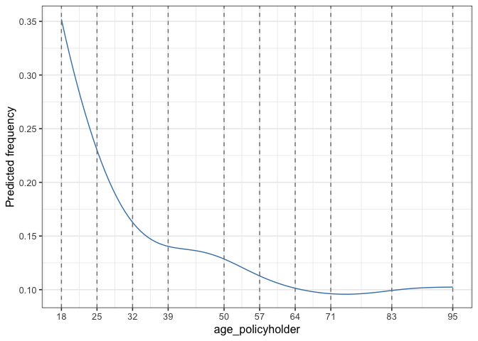

<!-- README.md is generated from README.Rmd. Please edit that file -->

# insurancerating

The goal of insurancerating is to give analytic techniques that can be
used in insurance rating. It provides a data driven strategy for the
construction of tariff classes in P\&C insurance. The goal is to bin the
continuous factors such that categorical risk factors result which
capture the effect of the covariate on the response in an accurate way,
while being easy to use in a generalized linear model (GLM).

It also adds functionality showing additional lines for the reference
categories in the levels of the coefficients in the output of a
generalized linear regression analysis. In addition it implements a
procedure determining the level of a factor with the largest exposure,
and thereafter changing the base level of the factor to this level.

## Installation

You can install insurancerating from github with:

``` r
# install.packages("devtools")
devtools::install_github("MHaringa/insurancerating")
```

## Example

This is a basic example which shows the techniques provided in
insurancerating.

The first part shows how to construct tariff classes for the variable
*age\_policyholder* in the MTPL dataset:

``` r
library(insurancerating)
library(ggplot2)
library(dplyr)

x <- construct_tariff_classes(data = MTPL, nclaims = nclaims, x = age_policyholder, exposure = exposure)
```

Show tariff classes:

``` r
autoplot(x)
```

<!-- -->

The second part adds the constructed tariff classes for the variable
*age\_policyholder* to the dataset, and sets the base level of the
factor *age\_policyholder* to the level with the largest exposure. In
this example the class for ages (35,52\], which contains the largest
exposure.

``` r

dat <- MTPL %>%
  mutate(age_policyholder_class = x$tariff_classes) %>%
  mutate_if(is.character, as.factor) %>%
  mutate_if(is.factor, funs(biggest_reference(., exposure)))

str(dat)
#> 'data.frame':    32731 obs. of  5 variables:
#>  $ age_policyholder      : int  43 21 54 44 20 38 68 45 76 30 ...
#>  $ nclaims               : int  0 0 0 1 1 0 0 1 0 0 ...
#>  $ exposure              : num  1 1 1 1 0.852 ...
#>  $ amount                : num  0 0 0 57540 2057 ...
#>  $ age_policyholder_class: Factor w/ 7 levels "(35,52]","[18,28]",..: 1 2 4 1 2 1 6 1 6 3 ...
```

The last part is to fit a *generalized linear model*. The function
rating\_factors prints the output including the reference
group.

``` r
model <- glm(nclaims ~ age_policyholder_class, offset = log(exposure), family = "poisson", data = dat)
rating_factors(model)
#>                     term     cluster  estimate
#> 1              Intercept (Intercept) 0.1377646
#> 2 age_policyholder_class     (35,52] 1.0000000
#> 3 age_policyholder_class     [18,28] 1.6929529
#> 4 age_policyholder_class     (28,35] 1.1454731
#> 5 age_policyholder_class     (52,59] 0.8315476
#> 6 age_policyholder_class     (59,66] 0.7361614
#> 7 age_policyholder_class     (66,82] 0.6918582
#> 8 age_policyholder_class     (82,95] 0.8843903
```
